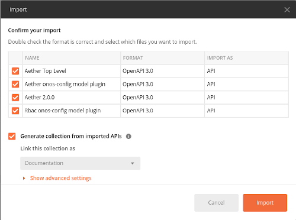
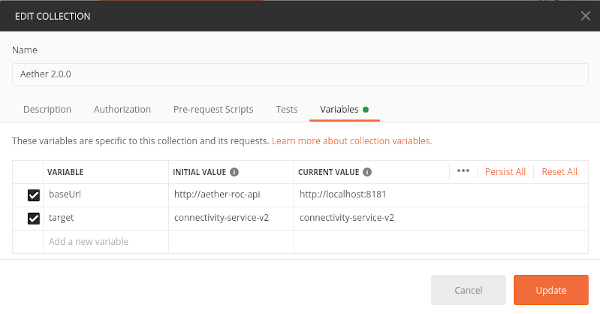
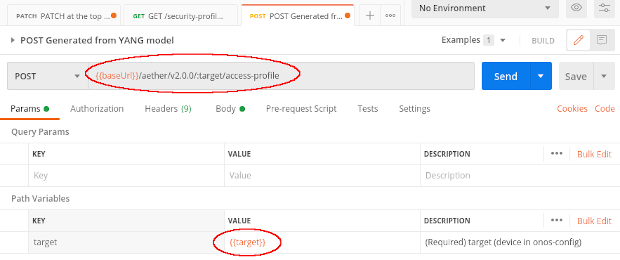
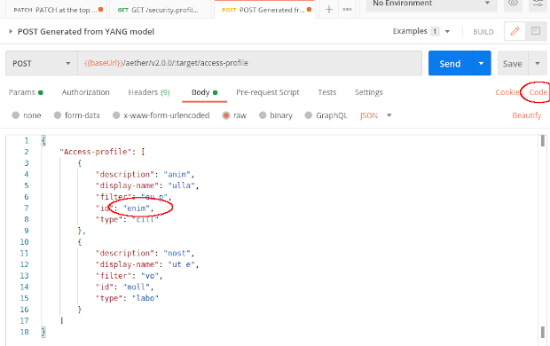

# aether-roc-api
Aether Operations Console API

This micro-service provides a REST interface in front of [aether-config] when running the model plugins:

* [Aether 3.0.0]
* [Aether 2.1.0]

`aether-config` exposes a [gNMI] interface on its Northbound, but is is very abstract 
and requires detailed knowledge of the underlying YANG models
to be able to use it as an API.

This is inconvenient and customers may prefer a REST interface instead.

## Requirements
This REST API then aims to be

* standardized - defined using Open API 3 (OAS 3.0)
* self describing & intuitive - the nuances of the YANG models should be visible in the API specification
* well documented - giving clear descriptions of the resources
* secure - should allow OAuth2 authentication and run over HTTPS
* complete - should allow changes to be made at a level of granularity
  equal to the underlying `aether-config` gNMI interface
* performant - the API should protect both the user and aether-config when there
  are tens of thousands of entries in lists, through paging
* convenient - the API should support sorting and filtering of lists

## API Design
The API offers:

* `GET`/`POST`/`DELETE` resources for every top level YANG object e.g. `aether/v2.0.0/{target}/subscribers`
* `GET`/`POST`/`DELETE` resources for single instances of devices beneath these e.g. `aether/v2.0.0/{target}/subscribers/ue/{id}`
* `PATCH` for the top level `aether-roc-api` that can combine updates and deletes
  for a multiplicity of targets and models in one call.
  This is for modifications only. There is no equivalent `GET` at this level

There a hierarchy of OpenAPI definition files in the `api`. The top level file:

* aether-top-level-openapi3.yaml

which imports:

* aether-3.0.0-openapi3.yaml
* aether-2.1.0-openapi3.yaml

### Using with Postman
> Other REST client tools are available. See https://www.slant.co/topics/7913/~rest-api-clients

To import the API in to a REST tool like [Postman], choose file -> import -> from folder -> select the `api` folder



This creates 4 collections with examples. It is convenient to set up variables (Edit Collection)
for repeatedly used parameters. e.g.



When performing a `POST` operation from the collection, the `{{target}}` parameter can be given,
and will be resolved and substituted in to the URL. e.g.



Clicking on the `Body` tab in the same `POST` command shows that Postman has created a
sample payload, based off the OpenAPI specification. 


> Ensure that the 'id' field has no spaces before submitting.

Postman can also create sample Curl commands equivalent to the graphical view.
Click the `Code` button to see the command e.g.

```
curl --location --request POST 'http://localhost:8181/aether/v2.0.0/connectivity-service-v2/access-profile' \
--header 'Content-Type: application/json' \
--data-raw '{
    "Access-profile": [
        {
            "description": "anim",
            "display-name": "ulla",
            "filter": "eu p",
            "id": "enim",
            "type": "cill"
        },
        {
            "description": "nost",
            "display-name": "ut e",
            "filter": "vo",
            "id": "moll",
            "type": "labo"
        }
    ]
}'
```

### Using the "Aether Top Level" PATCH command
The "Aether Top Level" can be used for the PATCH command.
> This interface is intended to be used only by expert users.

> Not every tool can handle the imports of one OpenAPI 3 file in to another. This unfortunately is true for Postman 7.x,
> for external files, but is planned to be fixed in future releases.

An example of using the PATCH update from Curl is
```bash
curl --location --request PATCH 'http://aether-roc-api/aether-roc-api' \
--header 'Content-Type: application/json' \
--data-raw '{
    "Updates": {
        "Access-profile-2.0.0": [
            {
                "description": "New Description",
                "id": "enim",
                "type": "cill"
            },
            {
                "display-name": "New display name",
                "id": "moll",
            }
        ]
    },
    "Extensions": {
        "model-version-101": "2.0.0",
        "model-type-102": "Aether"
    },
    "default-target": "connectivity-service-v2"
}'
```

## Implementation
The OpenAPI 3 YAML files in `./api` are generated from config models, e.g. [openapi-gen.go](https://github.com/onosproject/config-models/blob/master/modelplugin/aether-2.0.0/cmd/openapi-gen.go)

Much of the implementation is driven through code generation using DeepMap [oapi-codegen].
e.g. `make oapi-codegen-aether-2.0.0`

[gNMI]: https://github.com/openconfig/gnmi
[Open API 3]: http://spec.openapis.org/oas/v3.0.3
[aether-config]: https://github.com/onosproject/onos-config
[oapi-codegen]: https://github.com/deepmap/oapi-codegen
[Aether 1.0.0]: https://github.com/onosproject/config-models/tree/master/modelplugin/aether-1.0.0
[Aether 2.0.0]: https://github.com/onosproject/config-models/tree/master/modelplugin/aether-2.0.0
[Rbac 1.0.0]: https://github.com/onosproject/config-models/tree/master/modelplugin/rbac-1.0.0
[Postman]: https://www.postman.com/